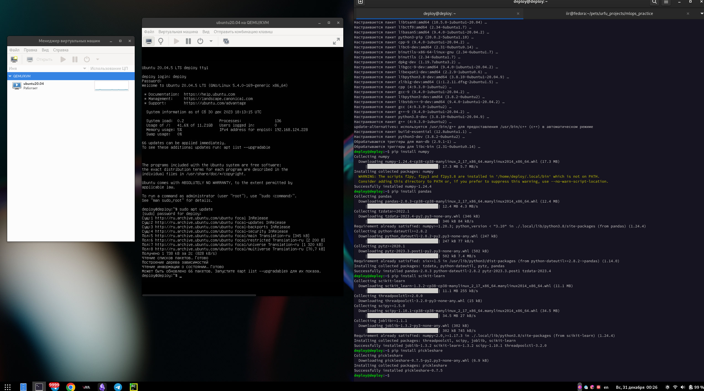
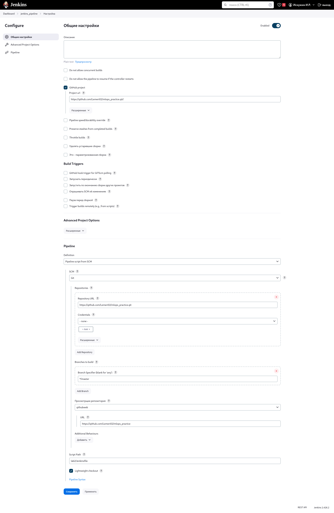
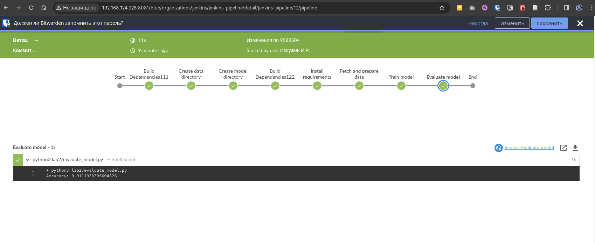
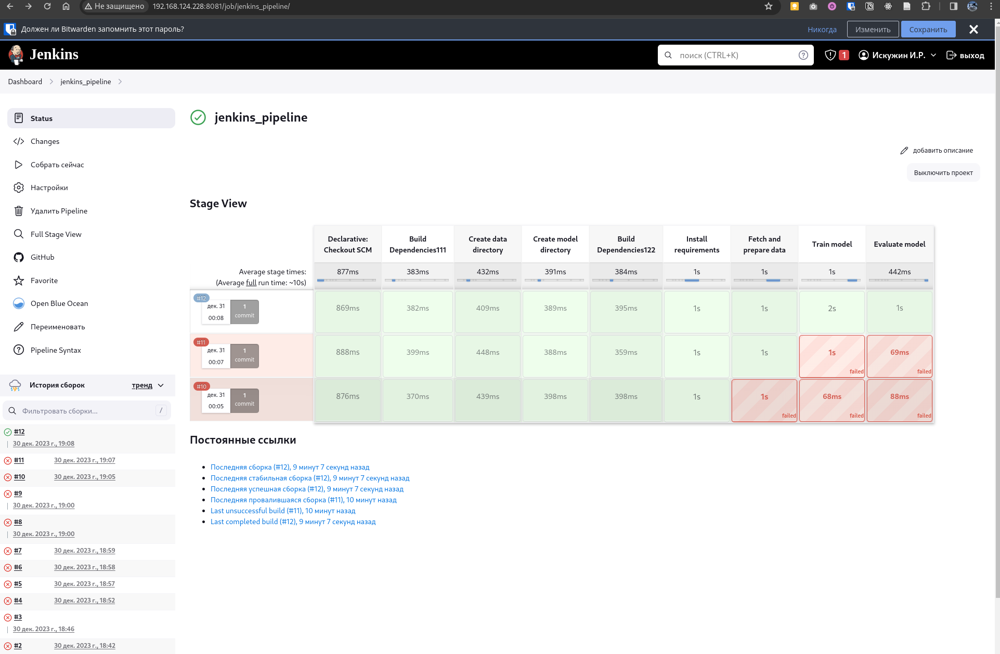

## MLOps. Практическое задание №2

0) Подготовил репозиторий на гитхабе. Подготовил код.

1) Развернул локально виртуальную машину (через KVM) (хост Fedora 39, виртуальная машина Ubuntu 20.04) [инструкция по установке libvirt virt-manager и т.д.](https://computingforgeeks.com/how-to-install-kvm-on-fedora/)


2) Установил Jenkins по инструкции

https://www.jenkins.io/doc/book/installing/linux/#debianubuntu

3) Установил Java для Jenkins 
```commandline
sudo apt update
sudo apt install fontconfig openjdk-17-jre
```
4) Устанавил доп. программы

```commandline
sudo apt install python3
sudo apt install pip
pip install numpy
pip install pandas
pip install scikit-learn

sudo apt install curl
sudo apt install git
```

5) Полезные команды для управления Jenkins:
```commandline
sudo systemctl status jenkins.service 
sudo systemctl restart jenkins.service
sudo systemctl start jenkins.service   
sudo systemctl stop jenkins.service 
```

6) sudo cat /var/lib/jenkins/secrets/initialAdminPassword - узнать токен для доступа к UI Jenkins

7) Попадаем в UI Jenkins http://localhost:8080 (в моем случае http://192.168.124.228:8081/)
8) Устанавливаем плагины
9) Создаем Item -> Pipeline
10) В настройках созданного Pipeline указываем ссылки на Git репозиторий, сохраняем

12) Запускаем сборку





